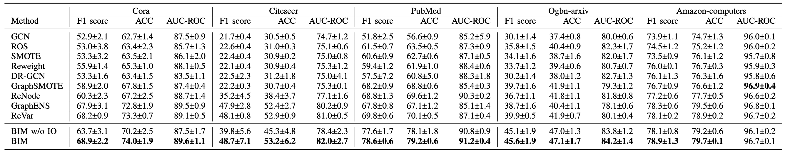
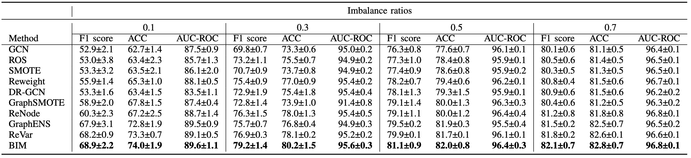

# BIM: Improving Graph Neural Networks with Balanced Influence Maximization

## Introduction
This repository is the implementation of BIM. 

To quick verify the authenticity of the results, we provide a jupyter notebook file (`code/test.ipynb`) including the result of cora dataset under `imbalance ratio=0.1`.


## Requirements
All experiments are implemented in Python 3.9 with Pytorch 1.12.1.
To install requirements:

```setup
pip install -r requirements.txt
```

## Data

We provide all datasets tested in our experiments, including the Cora, Citeseer, Pubmed, Ogbn-axiv, Amazon-computers.  The citation network datasets and Ogbn-arxiv dataset are under `data/`. Due to space limit, the Amazon-computers dataset will be downloaded automatically from [PyTorch Geometric](https://pytorch-geometric.readthedocs.io/en/latest/modules/datasets.html#torch_geometric.datasets.Amazon). 

Test datasets by setting `dataset = ['cora','citeseer','pubmed','ogbn','computers']`.

## Training

To train the model:

```bash
$ cd code
$ bash run.sh 
```
Or run `test.ipynb` for cora dataset under `imbalance ratio=0.1`.

## Results

1. Accuracy comparison:



2. Performance comparison under various imbalance ratios:



3. Interpretability:


